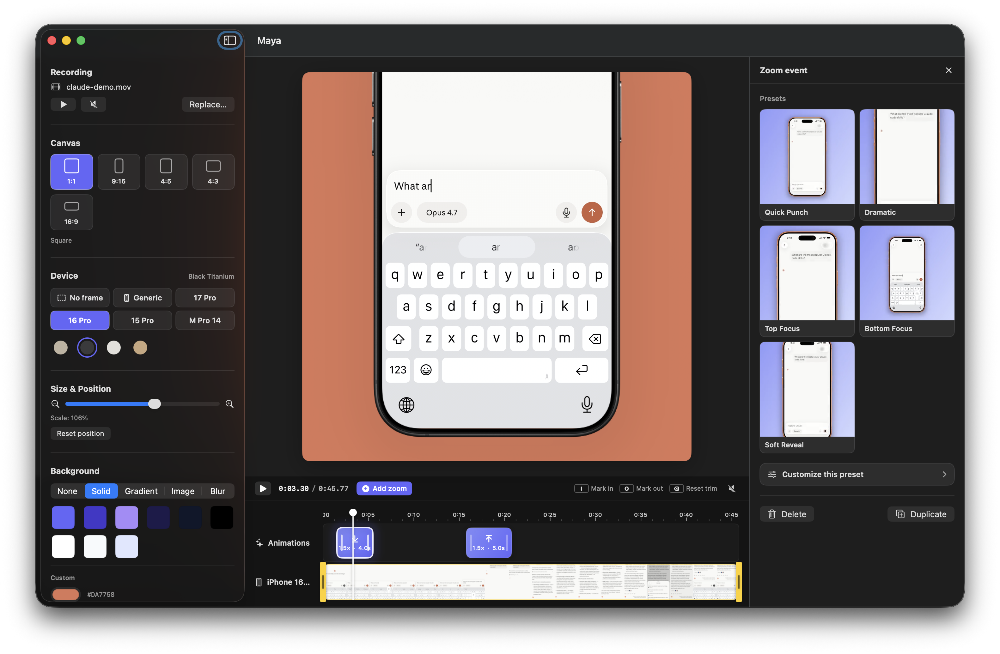

<div align="center">
  

  # Maya

  **Wrap your iPhone screen recordings in a beautiful device frame, add cinematic zoom moments, and export ready-to-share videos.**

  A native macOS app for turning raw screen recordings into polished marketing clips, social-media posts, and in-app tutorial overlays.

  
</div>

---

## ⬇️ Download

**[Download Maya for macOS](https://github.com/ronaldo-avalos/Maya/releases/latest/download/Maya.dmg)**  ·  [Website](https://ronaldo-avalos.github.io/Maya/)

Requires **macOS 26.3 (Tahoe)** or later. Maya is signed with a Developer ID and notarized by Apple — it opens with a normal double-click, no security workaround needed.

Want the latest unreleased changes? [Build from source](#-build--run). Maintainers: see [RELEASING.md](RELEASING.md).

---

## ✨ Features

### 🎬 Device framing
- Drop an iPhone screen recording — Maya wraps it in a clean device mockup with the correct screen cutout and corner radius.
- **Multiple devices**: iPhone 17 Pro, iPhone 16 Pro, iPhone 15 Pro, each with their official titanium color variants (Cosmic Orange, Deep Blue, Silver, Natural / Black / White / Desert Titanium…). Switch model and color from the sidebar in one click.
- **Generic** mode: a brand-agnostic frame with user-defined **bezel width** and **bezel color**.
- **No frame** mode: ship the bare screen recording with rounded corners only.
- A **corner radius slider** appears in Generic / No-frame modes so you can dial from sharp to stadium.
- The framed phone lives inside a configurable canvas — **1:1**, **9:16**, **4:5**, **4:3 landscape**, **16:9 widescreen** — so you can target Reels, Shorts, TikTok, YouTube, X, or in-app overlays from a single source.
- Manually scale and reposition the phone on the canvas via slider + drag.
- Optional **drop shadow** under the phone with controls for color, blur, X/Y offset, and opacity.

### 🎨 Backgrounds
A single picker, five modes:
- **None** — Photoshop-style checkered preview, exports to `.mov` with **HEVC + alpha**.
- **Solid** — brand-aligned palette + custom hex.
- **Gradient** — eight curated brand presets, all derived from the app's official color (`#6466FA`).
- **Image** — drop in any image, scale-to-fill.
- **Video Blur** — Keynote-style blurred poster of your own video as the backdrop.

### ⏱ Timeline & zoom animations
Like shots.so for Mac:
- Bottom track: live video thumbnails strip.
- Top track: hover anywhere to drop a **zoom event** with a `+` affordance.
- Each zoom event has a **start**, **duration**, **scale**, **focus** (Top / Center / Bottom), independent **zoom-in / zoom-out timing**, and a chosen **animation curve**.
- Drag the block to move it; drag the edges to resize. Everything snaps to **0.25 s** intervals and to the **playhead** when nearby.
- Live tooltips show timestamps while dragging.
- The playhead is scrubbable.
- Selecting a zoom event opens an inline **right-side editor panel** so every slider tweak updates the canvas in real time — no modal, no lost context.

### 🌀 Six animation curves
| Curve | Feel |
|---|---|
| **Spring** | Soft overshoot, lively (default) |
| **Bouncy** | More overshoot, playful |
| **Smooth** | Classic ease in/out |
| **Snappy** | Fast attack, slow settle |
| **Gentle** | Soft and organic |
| **Linear** | Constant rate, mechanical |

### 🚀 One-click presets
Pre-baked combinations of scale + focus + duration + curve: *Subtle Pop, Quick Punch, Dramatic, Top Focus, Bottom Focus, Long Hold, Mechanical, Soft Reveal.*

### 📤 Smart export
- **With background** → 1080×1080 (or your aspect) `.mp4`, H.264. Drop straight into Reels / TikTok / Shorts.
- **Transparent** (background set to *None*) → `.mov` with HEVC + alpha channel. Composite the framed phone over any UI inside another `AVPlayer` / `AVKit` consumer — perfect for in-app tutorials, Final Cut, Motion.
- All zoom animations bake into both exports.

### ⌨️ Keyboard shortcuts
| Key | Action |
|---|---|
| <kbd>Space</kbd> | Play / pause |
| <kbd>M</kbd> | Mute / unmute |
| <kbd>←</kbd> / <kbd>→</kbd> | Scrub ±0.25 s |
| <kbd>⇧</kbd>+<kbd>←</kbd> / <kbd>⇧</kbd>+<kbd>→</kbd> | Scrub ±1 s |
| <kbd>⌫</kbd> | Delete selected zoom event |
| <kbd>⌘</kbd>+<kbd>D</kbd> | Duplicate selected zoom event |

---

## 🛠 Tech stack

- **SwiftUI** + **AppKit** (custom `NSViewRepresentable` for `AVPlayerLayer`)
- **AVFoundation**: `AVMutableComposition`, custom `AVVideoCompositing`, `AVAssetExportSession`, manual `AVAssetReader` / `AVAssetWriter` pipeline for HEVC + alpha
- **Core Image** + **Metal** for per-frame compositing
- **VideoToolbox** for HEVC-with-alpha encoder properties
- **Swift Concurrency** (`@Observable`, actors, async/await) — export runs on a dedicated actor so the UI never blocks
- **App Sandbox** with file hard-link/copy adoption strategy (videos are brought into the sandbox container on load so AVFoundation reads work from any thread)

### Requirements
- macOS 26.3 (Tahoe) or later
- Xcode 26.5 or later
- An iPhone screen recording in `.mp4` / `.mov` format

### Build & run
```bash
git clone https://github.com/ronaldo-avalos/Maya.git
cd Maya
open Maya.xcodeproj
# In Xcode: ⌘R
```

---

## 🤝 Contributing — Maya is open source

This project is in active development and **contributions are very welcome**. Whether you're an iOS/macOS dev, a designer, or someone who just loves polished tools, there's a place for you.

### High-impact contribution areas

#### 📱 More device frames
Maya currently ships **iPhone 17 Pro**, **16 Pro**, and **15 Pro** (each with multiple color variants), plus a configurable Generic frame and a No-frame mode. PRs that add more devices are very welcome:
- iPhone 16 / 16 Plus, iPhone 15 / 15 Plus
- iPhone SE
- iPad mini / iPad Pro
- Older models (iPhone 14, 13, 12 family)
- Android devices (Pixel, Galaxy)

To add a frame:
1. Drop transparent-screen PNG(s) into `Maya/Assets.xcassets/iphone frames/` — one imageset per color variant.
2. Register the model in `Maya/Models/DeviceFrame.swift` (`DeviceModel`) with the frame aspect, normalized screen rect, corner radius, and a `DeviceColor` per variant. Append it to `DeviceModel.all`.
3. Submit a PR with a screenshot of the result. That's it.

#### 🎯 Feature ideas (good first issues)
- **Undo / Redo** for canvas, animations, and background changes (`⌘Z` / `⌘⇧Z`).
- **Saved projects** — persist a `.mayaproj` document on disk so users can come back to a layout.
- **Animation presets gallery** — visual previews of each preset playing on a sample phone in the editor sheet.
- **Trim controls** on the video track (drag in/out points to crop the recording).
- **Click-spot animations** — automatically zoom toward where the user tapped in the screen recording (parse the `.mp4` metadata if available, or expose a click-to-mark workflow).
- **Caption / annotation overlays** with their own timeline track.
- **Watermark toggle** for users who want a "Made with Maya" footer.

#### 🎨 Design / UX polish
- A more refined **empty state** for the canvas before any video is loaded.
- A **welcome screen** with recent projects.
- **Onboarding tooltips** for first-launch.
- An **export progress sheet** with thumbnail preview of the result.
- A **keyboard shortcuts cheat sheet** accessible from a menu item.
- More **gradient and solid color presets** that work for non-indigo brands.

#### 🐛 Engineering improvements
- **More iPhone screen orientations** (currently the compositor assumes portrait recordings).
- **HDR pass-through** for HDR screen recordings.
- **Audio waveform** rendering on the timeline.
- **Apple Silicon performance profiling** of the export pipeline.
- **CI** with GitHub Actions (build + lint).
- **Unit tests** for `AnimationSampler`, `DeviceFrame` coordinate math, and `BlurPosterCache`.

### How to contribute

1. **Fork** the repo and create a feature branch: `git checkout -b feature/iphone-16-pro`
2. **Code** the change. Try to match the existing style — small files, no unnecessary comments, single-responsibility views.
3. **Test** locally (⌘R). Take a screenshot or short GIF showing the change.
4. **Open a PR** with a clear title, a short description, and the screenshot/GIF.

For larger features, **open an issue first** so we can align on the approach before you spend hours on it.

### Code map

```
Maya/
├── MayaApp.swift                 App entry
├── ContentView.swift             Root → EditorView
├── Models/                       State + value types
│   ├── Project                   Root @Observable state (video, canvas, devices, shadow, animations…)
│   ├── DeviceFrame               DeviceModel + DeviceColor catalog (iPhone Pro family, Generic, None)
│   ├── CanvasAspectRatio         1:1, 9:16, 4:5, 4:3, 16:9 — pixel sizes + chip metadata
│   ├── PhoneShadow               Drop-shadow parameters (color, blur, offsets, opacity)
│   ├── BackgroundOption          Solid / gradient / image / video-blur / transparent
│   └── ZoomSegment               Per-segment zoom animation spec
├── Services/                     AVFoundation + Core Image plumbing
│   ├── DeviceFrameCompositor     Custom AVVideoCompositing (per-frame compositing)
│   ├── ExportService             Actor that runs both .mp4 and .mov exports
│   ├── AnimationSampler          Envelope math for zoom segments
│   ├── BlurPosterCache           One-shot blurred-frame cache
│   └── VideoThumbnailGenerator   Async timeline thumbnails
├── Views/                        SwiftUI views
│   ├── EditorView                Top-level layout (sidebar / canvas / timeline / editor panel)
│   ├── CanvasView                Configurable-ratio canvas with framed phone + background
│   ├── FramedDeviceView          Composite of video + frame overlay + shadow
│   ├── BackgroundPicker          Mode tabs + per-mode controls
│   ├── SettingsSidebar           Left sidebar (recording, canvas, device, transform, background, shadow, export)
│   ├── AnimationEditorSheet      Right panel for editing a selected zoom event (live preview)
│   └── Timeline/                 Ruler, video strip, animations track, draggable playhead
└── Assets.xcassets/              iPhone frame PNGs + app icon
```

---

## 📄 License

MIT — see [LICENSE](LICENSE).

You can fork, use Maya in personal or commercial projects, and ship derived work. Attribution is appreciated but not required.

---

## 🙏 Acknowledgements

- The app's brand color `#6466FA` borrows from the Tailwind/Indigo family.
- iPhone 15 / 16 / 17 Pro frame PNGs generated by the project owner.
- Built with ❤️ on macOS Tahoe.

If Maya helps you ship a video, tag [@ronaldo-avalos](https://github.com/ronaldo-avalos) — we'd love to see it.
# maya-v2
